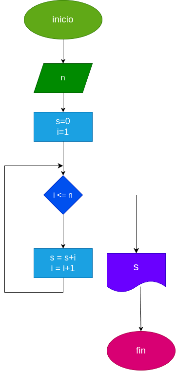

# while_1

trabajo con while en python

# analisis

## input

### variables

n = el numero al cual se le sumaran los numeros naturales anteriores

s = la suma de los n primeros numeros

i = es la variable utilizada para poder sumar los n primeros numeros

### processing

    while i <= n
    
        s = s+i
        i = i+1

# diseño

# construcccion
